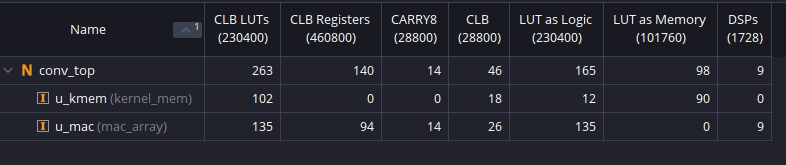
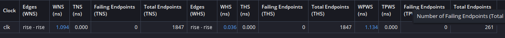
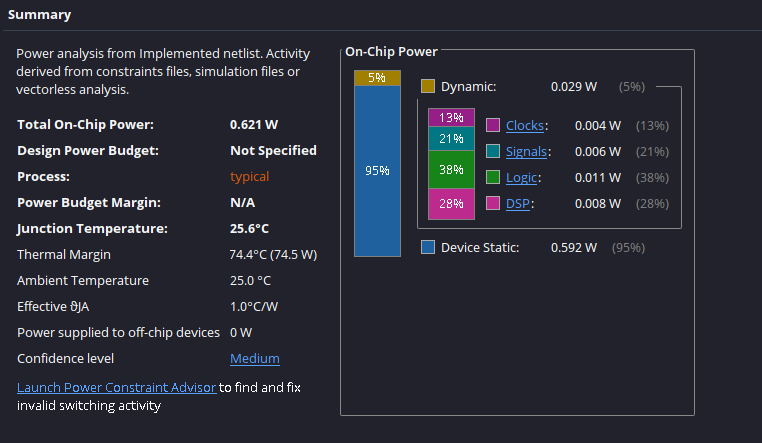
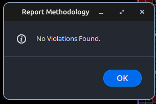
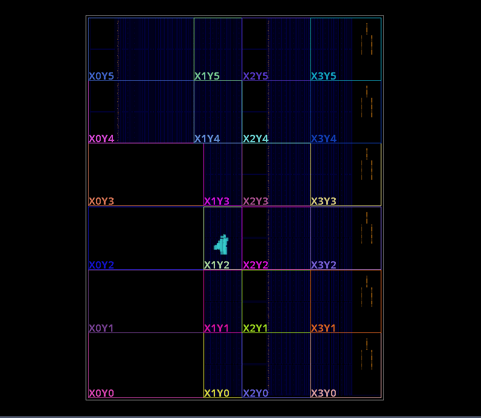
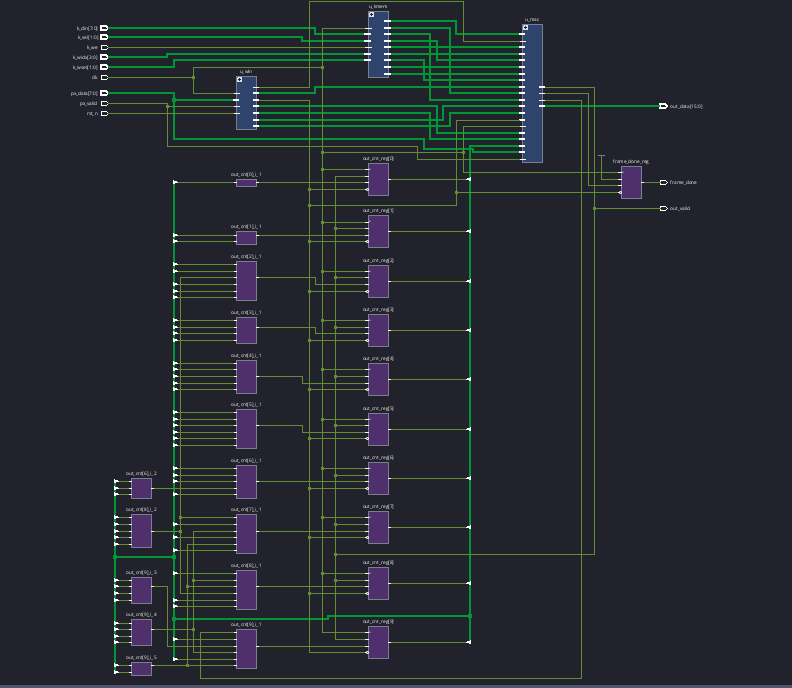
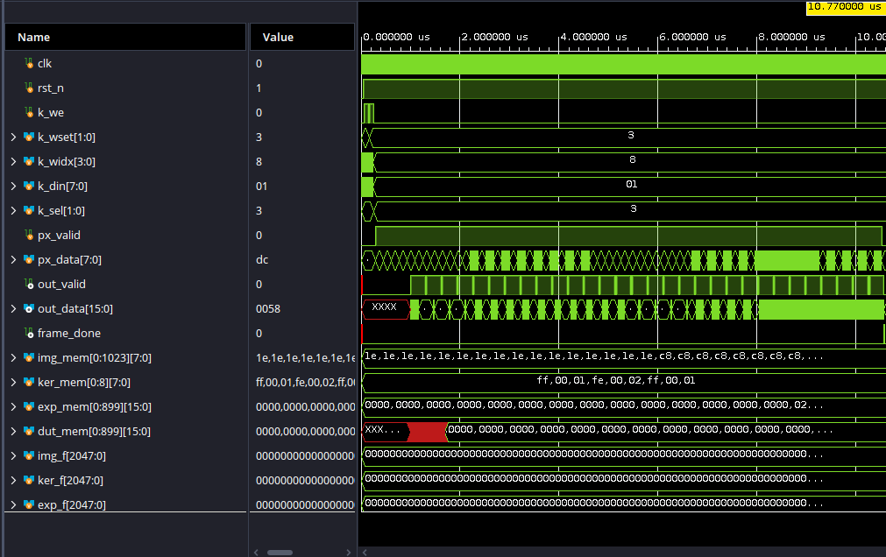
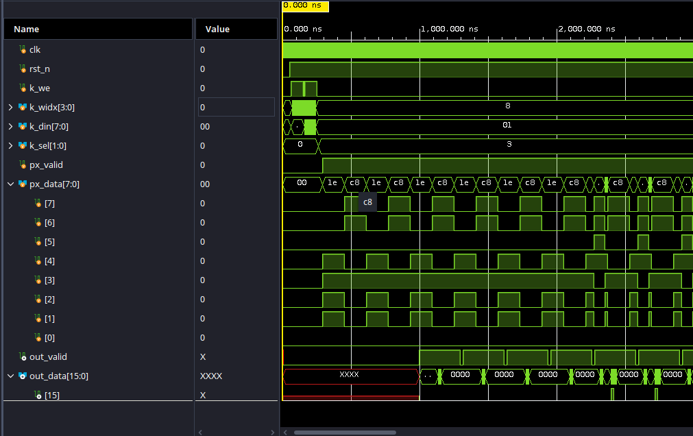
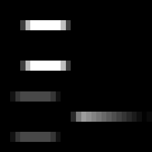

# HyperConv — N×N Convolution Accelerator

Entry for the **2026 IEEE SSCS Egypt Student Design Competition** (see
[plan.md](plan.md)): a fully pipelined, FPGA-based N×N convolution
accelerator for grayscale images / single-channel feature maps.

## Specifications

| Parameter | Value |
|---|---|
| Kernel | N×N (synthesis parameter, default 3×3), stride 1 |
| Coefficients | 8-bit signed, runtime-programmable, **4 selectable kernel sets** |
| Input | ≥32×32 (parameter), 8-bit unsigned pixels, streamed row-major |
| Output | 16-bit signed, saturated, "valid" convolution ((H−N+1)×(W−N+1)) |
| Throughput | **1 output pixel/cycle** in steady state (fully pipelined) |
| Latency | (N−1)·IMG_W + N pixels to first window + 5 pipeline cycles (71 total for 32×32, N=3) |
| BRAM | 0 — line buffers use distributed (LUT) RAM at these sizes |

Convolution is implemented as cross-correlation (no kernel flip), the CNN
framework convention; the golden model is bit-exact identical.

## Repository layout

```
rtl/        conv_top.v (top) · window_gen.v · line_buffer.v · kernel_mem.v · mac_array.v
            selftest/selftest_top.v — on-chip self-test wrapper for a board demo
tb/         tb_conv_top.v — self-checking, file-driven testbench
            tb_selftest.v — simulation check for the self-test wrapper
golden/     conv_golden.py + gen_tests.py — bit-exact Python reference & vector generator
            conv_golden.m + check_all_tests.m — MATLAB/Octave reference & RTL checker
sim/        run_all.sh — batch xsim runner · tests/<case>/ — generated vectors
synth/      build.tcl — batch OOC synth+impl (reports) · create_project.tcl — GUI project · ooc.xdc
            board/ — board_top.v + board.xdc (template) + build_bitstream.tcl for a demo bitstream
docs/       report material
```

## How to run

Requires Vivado (tested with 2025.2 at `/tools/2025.2/Vivado`; override with
`XILINX_VIVADO`) and Python 3 + numpy.

```bash
python3 golden/gen_tests.py     # generate stimulus + golden outputs
sim/run_all.sh                  # compile + simulate all 9 testcases (xsim)
sim/run_all.sh random_n5        # or a single testcase

# synthesis + implementation reports (utilization / timing / power):
vivado -mode batch -source synth/build.tcl
```

**Always run synthesis through `synth/build.tcl`** — it applies `synth/ooc.xdc`,
which defines the clock (`create_clock -period 3.333 -name clk [get_ports clk]`)
and the I/O delay budget. Synthesizing in the GUI without reading that XDC
leaves the `clk` port unconstrained, so `report_methodology` floods with
`TIMING-17` "clock pin not reached by a timing clock" criticals — one per
sequential cell (264 for this design). They are a missing-constraint artifact,
not a design bug; define the clock and they vanish:

```tcl
create_clock -period 3.333 -name clk [get_ports clk]
report_methodology
```

For an interactive GUI project (Flow Navigator, saved runs) instead of the
batch flow, source the project generator once in the Vivado Tcl Console, then
use **Run Synthesis** / **Run Implementation**:

```tcl
cd synth ; source create_project.tcl
```

It builds an out-of-context project at `vivado_ooc/` (gitignored) reading the
same `ooc.xdc`, so its reports match the batch flow (WNS +1.094 ns, 0
methodology violations).

Every test prints `TB: PASS/FAIL` plus measured latency; the runner
summarizes. Add `-testplusarg VCD` in `run_all.sh` (or run xsim manually) to
dump waveforms. In the xsim GUI, add signals with relative scoping —
`current_scope dut` then `add_wave *` — absolute paths like
`/tb_conv_top/dut/*` break when a non-default KSEL specializes the top
module name to `\tb_conv_top(KSEL=n)`.

The testbench also writes the raw RTL outputs to `sim/tests/<case>/dut_out.hex`
so they can be checked independently in MATLAB (or Octave):

```bash
matlab -batch "cd('golden'); check_all_tests"     # or:
octave --path golden --eval check_all_tests
```

This recomputes every case with `conv_golden.m` and compares against both the
Python golden outputs and the actual RTL outputs — a three-way cross-check.

## FPGA results (post-route, Vivado 2025.2, out-of-context, N=3, 32×32)

Two multiplier mappings measured on two parts; **DSP variant is the chosen
configuration** (better on every axis — the hard DSP registers absorb the
pipeline FFs and shorten the multiply path):

| | ZCU106 LUT-mult | **ZCU106 DSP** | Z7020 LUT-mult | **Z7020 DSP** |
|---|---|---|---|---|
| LUTs / FFs / DSPs / BRAMs | 842 / 404 / 0 / 0 | 263 / 140 / 9 / 0 | 851 / 463 / 0 / 0 | 290 / 140 / 9 / 0 |
| Fmax (constraint) | 479 MHz (300 ✓) | **598 MHz** (300 ✓)¹ | 173 MHz (200 ✗) | **259 MHz** (200 ✓) |
| Power: static + dynamic | 0.592 + 0.041 W | 0.592 + 0.029 W | 0.103 + 0.043 W | 0.103 + 0.034 W |
| FoM = Thr/(P·(LUT+50·DSP+100·BRAM)) | 1.88×10⁻³ | 2.26×10⁻³ | 8.05×10⁻³ | **9.79×10⁻³** |

ZCU106 = XCZU7EV-2 (user board); Z7020 = XC7Z020-1 (PYNQ-Z2/Zybo class).
The FoM gap between parts is almost entirely static power — the design
itself burns ≤43 mW.
¹ Internal fabric paths; with the I/O delay budget in the constraints the
reported WNS is +1.094 ns @ 300 MHz (Fmax ≈ 446 MHz), hold met (WHS +0.036).
`report_methodology` is fully clean — 0 violations.

Reproduce with `vivado -mode batch -source synth/build.tcl -tclargs
<part> <clk_ns> <tag> [lutmult]` (no tclargs = ZCU106 @ 300 MHz; DSP
multipliers are the default, `lutmult` forces the LUT variant). Reports
land in `synth/reports*/`. See `docs/report_skeleton.md` for the report
draft.

### Implementation reports (ZCU106, DSP variant, post-route)

<table>
<tr>
<td width="50%"><br><sub><b>Utilization</b> — 263 LUT / 140 FF / 9 DSP / 0 BRAM</sub></td>
<td width="50%"><br><sub><b>Timing</b> — WNS +1.094 ns, all constraints met</sub></td>
</tr>
<tr>
<td width="50%"><br><sub><b>Power</b> — 0.621 W total, 0.029 W dynamic</sub></td>
<td width="50%"><br><sub><b>Methodology</b> — 0 violations (clean)</sub></td>
</tr>
</table>

<table>
<tr>
<td width="50%"><br><sub><b>Device view</b> — placed &amp; routed core (9 DSP48E2, 0 BRAM)</sub></td>
<td width="50%"><br><sub><b>Schematic</b> — line-buffer + window + MAC pipeline</sub></td>
</tr>
</table>

## Verification status

All 9 testcases pass bit-exact against the golden model (Vivado 2025.2 xsim):
identity, hand-checked 4×4, full random 32×32 (contiguous and with random
input stalls), Sobel X/Y edge-detection demo, ±saturation extremes, and a
5×5-kernel run proving N parameterization. Kernel-set isolation is exercised
in every test by loading a decoy kernel into a neighboring set.

### Simulation waveforms (sobel_x, xsim)


*Full frame — `px_valid`/`px_data` stream in, `out_valid`/`out_data` stream out at 1 pixel/cycle, `frame_done` pulses on the last output.*


*Latency — 71 cycles (710 ns @ 100 MHz) from the first pixel to the first valid output.*

### Edge-detection demo (bonus)

The Sobel kernels run through both the golden model and the RTL on a synthetic
test scene (`golden/gen_tests.py` regenerates these):

<table>
<tr>
<td><br><sub><b>Input scene</b></sub></td>
<td><br><sub><b>Sobel X</b> (vertical edges)</sub></td>
<td><br><sub><b>Sobel Y</b> (horizontal edges)</sub></td>
</tr>
</table>

## Board demo / bitstream (bonus)

`rtl/selftest/selftest_top.v` is a standalone, board-independent self-test: on
reset it programs the kernel, streams a stored 32×32 image through `conv_top`,
compares every output to the golden result **on-chip**, and reports on LEDs —
`led[0]`=pass, `led[1]`=fail, `led[2]`=done, `led[3]`=heartbeat. Verified in
simulation (`tb/tb_selftest.v`: passes on correct data, asserts fail on wrong
data) and confirmed synthesizable (384 LUT / 9 DSP / 1 BRAM).

To build a bitstream, target it to a board: fill the package pins in
`synth/board/board.xdc` (clock + reset + 4 LEDs), then

```bash
vivado -mode batch -source synth/board/build_bitstream.tcl -tclargs <part> [<testcase>]
# e.g. ... -tclargs xc7a35tcpg236-1 sobel_x
```

This runs synth → impl → `write_bitstream`, producing
`synth/board/build/hyperconv_selftest.bit`. The `<testcase>` (default
`sobel_x`) selects which `sim/tests/<case>` vectors bake into the ROMs.
`synth/board/board_top.v` handles the clock buffer (single-ended by default;
comments show the differential-clock swap) and reset polarity.
