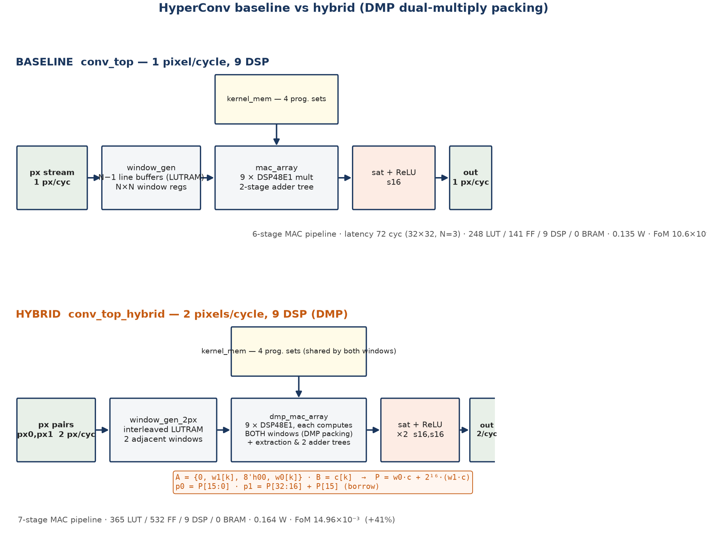
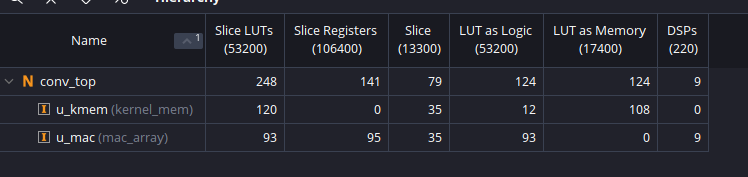
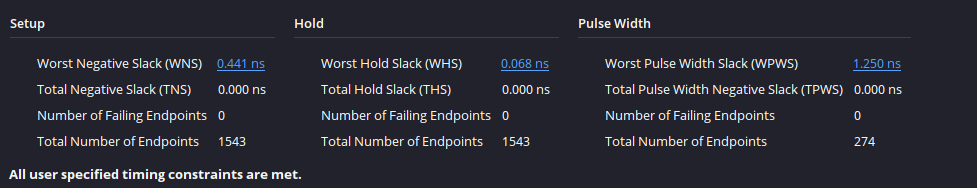
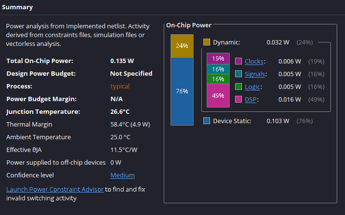
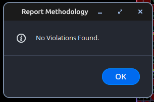
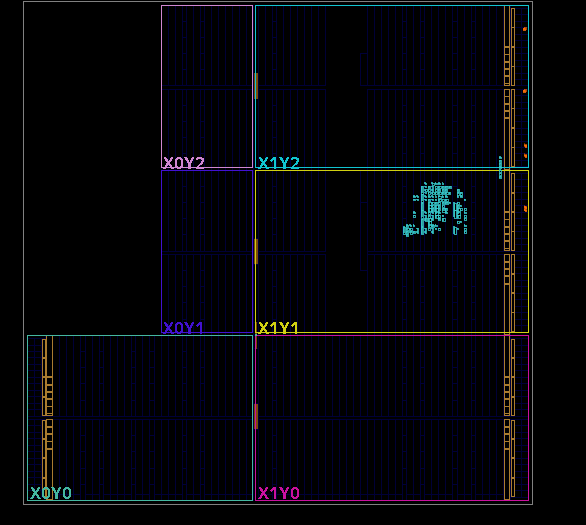
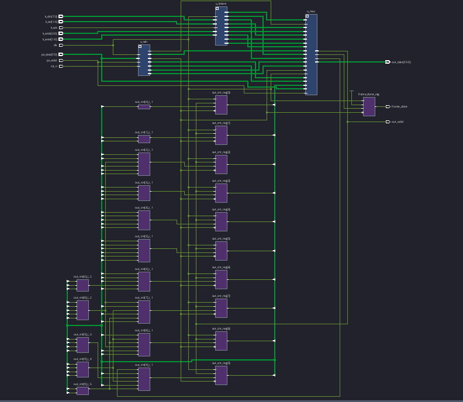
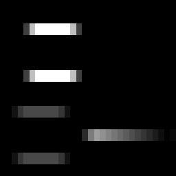

# HyperConv — N×N Convolution Accelerator (baseline + hybrid)

Entry for the **2026 IEEE SSCS Egypt Student Design Competition** (see
[plan.md](plan.md)): a fully pipelined, FPGA-based N×N convolution
accelerator for grayscale images / single-channel feature maps.

This branch (`hybrid-dmp-multipumping`) adds a **hybrid 2-pixel/cycle
architecture** on top of the proven baseline. The baseline (`main`) is
untouched and fully reproducible; both cores coexist and share the same
golden models, testcases and flow. Full comparison and analysis:
[docs/hybrid_results.md](docs/hybrid_results.md).

| | Baseline `conv_top` | **Hybrid `conv_top_hybrid`** |
|---|---|---|
| Throughput | 1 px/cycle | **2 px/cycle** |
| LUT / FF / DSP / BRAM | 248 / 141 / 9 / 0 | 365 / 532 / **9** / 0 |
| Timing @ 200 MHz | WNS +0.441 | **WNS +0.502** (hold met) |
| Power (vectorless) | 0.135 W | 0.164 W |
| Verification | 11/11 bit-exact | **11/11 bit-exact** (same vectors) |
| **FoM** | 10.60×10⁻³ | **14.96×10⁻³ (+41%)** |

The hybrid keeps the baseline's streaming architecture and adds
**dual-multiply packing (DMP)**: each of the 9 DSP48E1 blocks computes the
product for *both* horizontally adjacent windows against the same shared
coefficient — two packed pixels ride the DSP's 25-bit A port at stride 16,
with a one-bit borrow correction on extraction. 2 px/cycle on the same 9
DSPs, single clock domain, no MMCM/CDC. Verified standalone on 101k vectors
(`experiments/dmp_probe/`) and end-to-end through all 11 golden testcases.

## Specifications

| Parameter | Value |
|---|---|
| Kernel | N×N (synthesis parameter, default 3×3), stride 1 |
| Coefficients | 8-bit signed, runtime-programmable, **4 selectable kernel sets** |
| Input | ≥32×32 (parameter), 8-bit unsigned pixels, streamed row-major |
| Output | 16-bit signed, saturated, "valid" convolution ((H−N+1)×(W−N+1)) |
| Activation | optional ReLU (parameter `RELU=1`): negatives clamp to 0, +7 LUTs |
| Throughput | **1 output pixel/cycle** in steady state (fully pipelined) |
| Latency | (N−1)·IMG_W + N pixels to first window + 6 pipeline cycles (72 total for 32×32, N=3) |
| BRAM | 0 — line buffers use distributed (LUT) RAM at these sizes |

Convolution is implemented as cross-correlation (no kernel flip), the CNN
framework convention; the golden model is bit-exact identical.

## Repository layout

```
rtl/        conv_top.v (baseline top) · window_gen.v · line_buffer.v · kernel_mem.v · mac_array.v
            conv_top_hybrid.v (hybrid top) · window_gen_2px.v · dmp_mac_array.v
            selftest/selftest_top.v — on-chip self-test wrapper for a board demo
tb/         tb_conv_top.v (baseline) · tb_conv_top_hybrid.v (hybrid) — self-checking, file-driven
            tb_selftest.v — simulation check for the self-test wrapper
golden/     conv_golden.py + gen_tests.py — bit-exact Python reference & vector generator
            conv_golden.m + check_all_tests.m — MATLAB/Octave reference & RTL checker
sim/        run_all.sh — baseline batch xsim runner · run_all_hybrid.sh — hybrid runner
            tests/<case>/ — generated vectors (shared by both cores)
synth/      build.tcl — baseline OOC synth+impl · build_hybrid.tcl — hybrid OOC synth+impl
            create_project.tcl — GUI project · ooc.xdc
            board/ — board_top.v + board.xdc (template) + build_bitstream.tcl for a demo bitstream
experiments/ dmp_probe/ — isolated DMP packing proof (RTL + TB + synth script)
docs/       report material · hybrid_results.md — baseline vs hybrid comparison
```

## How to run

Requires Vivado (tested with 2025.2 at `/tools/2025.2/Vivado`; override with
`XILINX_VIVADO`) and Python 3 + numpy.

```bash
python3 golden/gen_tests.py     # generate stimulus + golden outputs
sim/run_all.sh                  # baseline: all 11 testcases (xsim)
sim/run_all_hybrid.sh           # hybrid:   all 11 testcases (same vectors)

# synthesis + implementation reports (utilization / timing / power):
vivado -mode batch -source synth/build.tcl         # baseline
vivado -mode batch -source synth/build_hybrid.tcl  # hybrid
```

Both runners use the identical `sim/tests/` vectors and both print per-test
latency plus a PASS/FAIL summary — the hybrid must (and does) produce
bit-identical outputs to the baseline and the golden model. Hybrid RTL
constraints: `IMG_W` even, `N` odd (all competition kernels 3×3/5×5).

**Always run synthesis through `synth/build.tcl`** — it applies `synth/ooc.xdc`,
which defines the clock (`create_clock -period 5.0 -name clk [get_ports clk]`)
and the I/O delay budget. Synthesizing in the GUI without reading that XDC
leaves the `clk` port unconstrained, so `report_methodology` floods with
`TIMING-17` "clock pin not reached by a timing clock" criticals — one per
sequential cell (264 for this design). They are a missing-constraint artifact,
not a design bug; define the clock and they vanish:

```tcl
create_clock -period 5.0 -name clk [get_ports clk]
report_methodology
```

For an interactive GUI project (Flow Navigator, saved runs) instead of the
batch flow, source the project generator once in the Vivado Tcl Console, then
use **Run Synthesis** / **Run Implementation**:

```tcl
cd synth ; source create_project.tcl
```

It builds an out-of-context project at `vivado_ooc/` (gitignored) reading the
same `ooc.xdc`, so its reports match the batch flow.

Every test prints `TB: PASS/FAIL` plus measured latency; the runner
summarizes. Add `-testplusarg VCD` in `run_all.sh` (or run xsim manually) to
dump waveforms. In the xsim GUI, add signals with relative scoping —
`current_scope dut` then `add_wave *` — absolute paths like
`/tb_conv_top/dut/*` break when a non-default KSEL specializes the top
module name to `\tb_conv_top(KSEL=n)`.

The testbench also writes the raw RTL outputs to `sim/tests/<case>/dut_out.hex`
so they can be checked independently in MATLAB (or Octave):

```bash
matlab -batch "cd('golden'); check_all_tests"     # or:
octave --path golden --eval check_all_tests
```

This recomputes every case with `conv_golden.m` and compares against both the
Python golden outputs and the actual RTL outputs — a three-way cross-check.

## FPGA results (post-route, Vivado 2025.2, out-of-context, N=3, 32×32)

Two multiplier mappings measured on two parts; **DSP variant is the chosen
configuration** (better on every axis — the hard DSP registers absorb the
pipeline FFs and shorten the multiply path):

| | Z7020 LUT-mult | **Z7020 DSP** | ZCU106 LUT-mult | ZCU106 DSP |
|---|---|---|---|---|
| LUTs / FFs / DSPs / BRAMs | 858 / 562 / 0 / 0 | **248 / 141 / 9 / 0** | 842 / 404 / 0 / 0 | 263 / 140 / 9 / 0 |
| Fmax (constraint) | 168 MHz (200 ✗) | **219 MHz** (200 ✓)¹ | 479 MHz (300 ✓) | 598 MHz (300 ✓)² |
| Power: static + dynamic | 0.103 + 0.048 W | **0.103 + 0.032 W** | 0.592 + 0.041 W | 0.592 + 0.029 W |
| FoM = Thr/(P·(LUT+50·DSP+100·BRAM)) | 7.67×10⁻³ | **10.6×10⁻³** | 1.88×10⁻³ | 2.26×10⁻³ |

Z7020 = XC7Z020-1 (PYNQ-Z2 — current target board, `synth/reports_z2_dsp/`
and `synth/reports_z2_lutmult/`); ZCU106 = XCZU7EV-2 (previous target,
retained for comparison). The FoM gap between parts is almost entirely
static power — the design itself burns ≤43 mW.
¹ Chosen configuration, incl. I/O delay budget: WNS +0.441 ns @ 200 MHz,
hold met (WHS +0.068 ns). `report_methodology` clean — 0 violations.
² ZCU106 internal fabric paths; with the I/O budget, WNS +1.094 ns @ 300 MHz
(Fmax ≈ 446 MHz), hold met (WHS +0.036).

Reproduce with `vivado -mode batch -source synth/build.tcl -tclargs
<part> <clk_ns> <tag> [lutmult]` (no tclargs = PYNQ-Z2 @ 200 MHz; DSP
multipliers are the default, `lutmult` forces the LUT variant). Reports
land in `synth/reports*/`. See `docs/report_skeleton.md` for the report
draft.

## Hybrid FPGA results (same flow: OOC, post-route, Vivado 2025.2, N=3, 32×32)


*The hybrid reuses the baseline streaming architecture; each DSP48E1
computes both adjacent windows' products (DMP), so 2 px/cycle costs no
extra DSPs.*

| | Baseline | **Hybrid (DMP)** | Δ |
|---|---|---|---|
| Throughput | 1 px/cyc | **2 px/cyc** | 2× |
| LUTs | 248 | 365 | +117 (extraction, 2nd adder tree, wider window) |
| FFs | 141 | 532 | +391 (2nd window set + product regs) |
| DSPs | 9 | **9** | 0 — the whole point of DMP |
| BRAMs | 0 | **0** | — |
| WNS @ 200 MHz | +0.441 | **+0.502** | more slack, hold met |
| Power total (dyn) | 0.135 W (32 mW) | 0.164 W (60 mW) | +29 mW |
| **FoM** | 10.60×10⁻³ | **14.96×10⁻³** | **+41%** |

```
FoM = throughput / [power × (LUT + 50·DSP + 100·BRAM)]
baseline: 1 / [0.135 × 698]  = 10.60×10⁻³
hybrid:   2 / [0.164 × 815]  = 14.96×10⁻³
```

Candidates investigated and eliminated with measured/arithmetic arguments
(details in [docs/hybrid_results.md](docs/hybrid_results.md)):

- **DMP with separate coefficients** — infeasible: the DSP48E1's 18-bit B
  port caps the packing stride below what cross-term isolation needs.
- **DSP cascade accumulation** — arithmetically impossible at stride 16:
  the packed window-0 sum (s19) overflows the low field.
- **Multipumping (DSP @ 2×Fs)** — dominated: DMP already supplies the 18
  multiplies/system-cycle that 2 px needs; pumping adds an MMCM + CDC for
  zero gain, and 4-phase pumping (~880 MHz) does not close on −1 fabric.
- **2 px/cycle without DMP (18 DSP)** — FoM-neutral (denominator +450).

Reproduce: `vivado -mode batch -source synth/build_hybrid.tcl` →
`synth/reports_hybrid/`, checkpoint `synth/conv_top_hybrid_routed.dcp`.

### Implementation reports (ZCU106 builds — previous target, DSP variant, post-route)

<table>
<tr>
<td width="50%"><br><sub><b>Utilization</b> — 263 LUT / 140 FF / 9 DSP / 0 BRAM</sub></td>
<td width="50%"><br><sub><b>Timing</b> — WNS +1.094 ns, all constraints met</sub></td>
</tr>
<tr>
<td width="50%"><br><sub><b>Power</b> — 0.621 W total, 0.029 W dynamic</sub></td>
<td width="50%"><br><sub><b>Methodology</b> — 0 violations (clean)</sub></td>
</tr>
</table>

<table>
<tr>
<td width="50%"><br><sub><b>Device view</b> — placed &amp; routed core (9 DSP48E2, 0 BRAM)</sub></td>
<td width="50%"><br><sub><b>Schematic</b> — line-buffer + window + MAC pipeline</sub></td>
</tr>
</table>

## Verification status

All 11 testcases pass bit-exact against the golden model (Vivado 2025.2 xsim)
— **for both the baseline and the hybrid**, against the same expected files:
identity, hand-checked 4×4, full random 32×32 (contiguous and with random
input stalls), Sobel X/Y edge-detection demo, ±saturation extremes, a
5×5-kernel run proving N parameterization, and two ReLU-activation runs
(mixed-sign outputs clamp at 0; the all-negative case yields an all-zero
frame). Kernel-set isolation is exercised
in every test by loading a decoy kernel into a neighboring set. The DMP
packing itself was additionally proven standalone on 101,276 vectors
(`experiments/dmp_probe/`, 0 errors) before integration.

### Simulation waveforms (sobel_x, xsim)


*Full frame — `px_valid`/`px_data` stream in, `out_valid`/`out_data` stream out at 1 pixel/cycle, `frame_done` pulses on the last output.*


*Latency — 72 cycles (720 ns @ 100 MHz) from the first pixel to the first valid output.*

### Edge-detection demo (bonus)

The Sobel kernels run through both the golden model and the RTL on a synthetic
test scene (`golden/gen_tests.py` regenerates these):

<table>
<tr>
<td><br><sub><b>Input scene</b></sub></td>
<td><br><sub><b>Sobel X</b> (vertical edges)</sub></td>
<td><br><sub><b>Sobel Y</b> (horizontal edges)</sub></td>
</tr>
</table>

## Board demo / bitstream (bonus)

`rtl/selftest/selftest_top.v` is a standalone, board-independent self-test: on
reset it programs the kernel, streams a stored 32×32 image through `conv_top`,
compares every output to the golden result **on-chip**, and reports on LEDs —
`led[0]`=pass, `led[1]`=fail, `led[2]`=done, `led[3]`=heartbeat. Verified in
simulation (`tb/tb_selftest.v`: passes on correct data, asserts fail on wrong
data) and confirmed synthesizable (399 LUT / 9 DSP / 0.5 BRAM on PYNQ-Z2,
timing met with WNS +4.055 ns @ 100 MHz).

To build a bitstream, target it to a board: fill the package pins in
`synth/board/board.xdc` (clock + reset + 4 LEDs), then

```bash
vivado -mode batch -source synth/board/build_bitstream.tcl -tclargs <part> [<testcase>]
# e.g. ... -tclargs xc7a35tcpg236-1 sobel_x
```

This runs synth → impl → `write_bitstream`, producing
`synth/board/build/hyperconv_selftest.bit`. The `<testcase>` (default
`sobel_x`) selects which `sim/tests/<case>` vectors bake into the ROMs.
`synth/board/board_top.v` handles the clock buffer (single-ended by default;
comments show the differential-clock swap) and reset polarity.

### Hybrid board demo

The hybrid core has its own self-test wrapper, verified in simulation
(`tb/tb_selftest_hybrid.v`: PASS, 542 cycles — twice as fast as the
baseline wrapper) and built for PYNQ-Z2:

```bash
vivado -mode batch -source synth/board/build_bitstream_hybrid.tcl \
    -tclargs xc7z020clg400-1 sobel_x
# → synth/board/build_hybrid/hyperconv_hybrid_selftest.bit
```

Same pins, same LED mapping (pass/fail/done/heartbeat), same baked vectors
as the baseline — `board.xdc` is reused verbatim. Post-route: 579 LUT /
597 FF / 9 DSP / 0 BRAM, WNS +3.068 @ 100 MHz, DRC clean (ZPS7-1 advisory
only, as on the baseline board flow).
