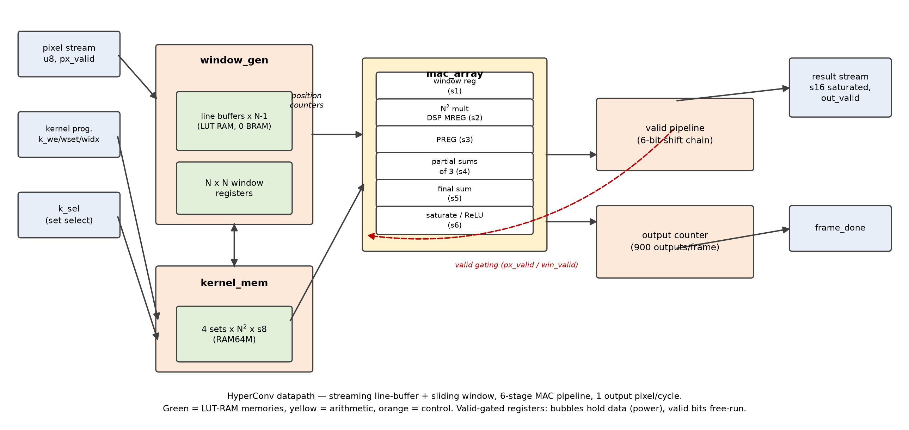
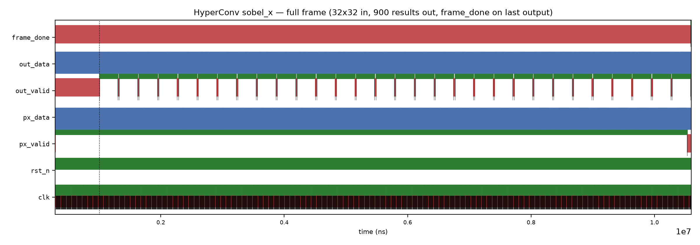
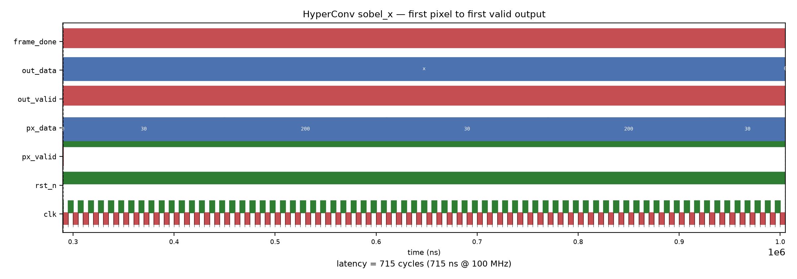

# HyperConv — Competition Report Skeleton

> Working draft for the 2026 IEEE SSCS Egypt Student Design Competition report.
> Sections map 1:1 to the deliverables checklist in plan.md. Items marked
> `TODO` need content or final numbers.

## 1. Architecture overview

Streaming line-buffer + sliding-window architecture, fully pipelined at
**1 output pixel per cycle** (bonus feature):


*HyperConv datapath: pixel stream → window generation (line buffers +
window registers) → 6-stage MAC pipeline → saturated s16 result stream.*

```
px stream ──► window_gen ──────────► mac_array ──► out stream (s16, saturated)
               │ N−1 line buffers      │ N² multipliers
               │ (distributed RAM)     │ two-stage adder tree
               │ N×N window regs       │ saturation stage
               └ position counters     └ 6-stage pipeline
kernel bus ─► kernel_mem (4 programmable sets, registered select mux)
```

- **No control FSM is needed for the datapath**: the design is a free-running
  pipeline gated by `px_valid`; position counters derive window validity.
  (Report should explain this as a deliberate simplification over the
  classic LOAD/COMPUTE/WRITE FSM — fewer states, no dead cycles.)
- **"Valid" convolution** (no padding): output is (H−N+1)×(W−N+1).
  Assumption stated explicitly; frames can stream back-to-back with no
  flush cycles because window validity is position-based.
- Input stalls (`px_valid` low) are tolerated arbitrarily; verified with
  randomized-gap testcase.

## 2. Fixed-point analysis

| Signal | Format | Range | Bits |
|---|---|---|---|
| Input pixel | UQ8.0 | 0 … 255 | 8 (unsigned) |
| Coefficient | SQ8.0 | −128 … +127 | 8 (signed) |
| Product | u8×s8 | −32 640 … +32 385 | 16 (signed) |
| Partial sum (3 products) | 16 + 2 | ±97 155 max | 18 (signed) |
| Accumulator (N=3) | 18 + ⌈log₂3⌉ | ±291 465 max | 20 (signed) |
| Output | SQ16.0 | −32 768 … +32 767 | 16 (signed, **saturated**) |

- Accumulator is full-precision → **no intermediate overflow possible**;
  the only precision decision is the final saturation to 16 bits
  (no rounding needed — integer arithmetic is exact).
- Numeric example (TODO: copy one window from hand_4x4 testcase).
- Justification of 8-bit unsigned input: native grayscale range.

## 3. RTL implementation

- `conv_top.v` — integration + frame_done bookkeeping
- `window_gen.v` — counters, N−1 chained line buffers, N×N window shifter
- `line_buffer.v` — async-read row RAM → distributed RAM, **0 BRAM**
- `kernel_mem.v` — 4 kernel sets × N² × s8, single write port, registered mux
- `mac_array.v` — N² multipliers, two-stage adder tree (partial sums of 3,
  then final sum — keeps logic depth low on slow fabrics), saturation;
  valid-gated data registers for power
- Pipeline latency: 6 cycles (window reg → product (MREG) → product reg
  (PREG) → partial → sum → saturate)

### 3.1 Memory organization

The design uses three small memories, all mapped to LUT RAM (distributed
RAM) — **0 BRAMs** at the default 32-px configuration, avoiding the
100× BRAM penalty in the FoM:

| Memory | Size (default) | Primitive | Ports | Why |
|---|---|---|---|---|
| Kernel sets (`kernel_mem.v`) | 4 sets × 9 × 8 b = 288 b | RAM64M | 1 write (programming) + 4 read (one per row of the window) | read every cycle after one-cycle registered select; RAM64M gives 4 reads/LUT-pair |
| Line buffers (`line_buffer.v` ×N−1) | 2 × 32 × 8 b = 512 b | RAM32X1S | 1 write + 1 async read | depth = IMG_W; async read keeps the window shifter in one cycle |
| Window registers | 9 × 8 b | FFs | — | the N×N sliding window itself is a register matrix, not a memory |

Scaling: each line buffer is IMG_W deep × PIX_W wide; for IMG_W ≤ 64 the
16:1 LUT ratio keeps them in one LUT-pair per bit. Beyond ~128 px a BRAM
per line buffer becomes the natural mapping (and the FoM would then count
it); the parameterization allows that without RTL change.

### 3.2 Datapath control: no FSM by design

The accelerator datapath is **free-running**: it has no LOAD / COMPUTE /
WRITE FSM. Control is reduced to a *valid-bit pipeline*:

- `px_valid` gates every data register stage; when low, the stage holds
  (bubbles propagate down the valid chain, data does not switch — power
  saving for free).
- Window validity (`win_valid`) is derived **positionally** from the
  pixel counters (row ≥ N−1 and col ≥ N−1): no flush or drain state is
  needed between frames, and frames can stream back-to-back.
- `frame_done` is a one-cycle pulse generated when the output counter
  wraps — pure bookkeeping, no state machine.

This is a deliberate simplification over the classic convolution FSM: the
only sequential "control" is the (IMG_W, IMG_H) position counter pair and
the 6-bit valid shift chain. Arbitrary input stalls are tolerated
(verified by the `random_n3_gaps` testcase).

### 3.3 Self-test wrapper FSM (board demo)

The board demo wrapper (`rtl/selftest/selftest_top.v`) *does* use a
6-state FSM to sequence the standalone demo — program, stream, compare:

```
        ┌────────┐  kernel ROM    ┌────────┐  settle 1 cy ┌─────────┐
 ──►    │ S_IDLE │ ─────────────► │ S_LOADK│ ───────────► │  S_SETK │
        └────────┘   idx 0..N²−1  └────────┘              └─────────┘
                                                           │ set k_sel
                              last output (frame_done)     ▼
        ┌────────┐  all 900 outputs  ┌────────┐  1 px/cycle ┌────────┐
   ┌──► │ S_DONE │ ◄──────────────── │ S_WAIT │ ◄────────── │S_STREAM│
   │    └────────┘    compared       └────────┘             └────────┘
   └── LEDs: pass/fail/done latched; heartbeat free-runs
```

- `S_LOADK`: writes the 9 coefficients of kernel set 0 through the normal
  programming port (also exercises the write path on silicon).
- `S_SETK`: one idle cycle for the registered kernel-select mux.
- `S_STREAM`: streams the stored 32×32 image at 1 px/cycle.
- `S_WAIT`: drains the pipeline until `frame_done`; on-chip comparison
  runs in parallel whenever `out_valid` fires (mismatch latches `fail`).
- `S_DONE`: latches pass/fail/done LEDs.

## 4. Verification

Golden models: `golden/conv_golden.py` (numpy) and `golden/conv_golden.m`
(MATLAB/Octave), both bit-exact including saturation. Vector generator:
`golden/gen_tests.py`. Verification is a three-way cross-check: the
self-checking TB compares every output pixel against the Python golden
files, dumps the raw RTL outputs (`dut_out.hex`), and
`golden/check_all_tests.m` independently recomputes each case in MATLAB
and compares against both. 11 testcases, all **PASS** (Vivado 2025.2 xsim):

| Testcase | Purpose | Result |
|---|---|---|
| identity_n3 | Sanity: output = cropped input | PASS |
| hand_4x4 | Hand-verifiable 4×4, all-ones kernel | PASS |
| random_n3 | Full random image + kernel | PASS |
| random_n3_gaps | Same, with random input stalls | PASS |
| sobel_x / sobel_y | Edge-detection demo (bonus) | PASS |
| saturate_max / min | ±saturation extremes | PASS |
| random_n5 | 5×5 kernel (N parameterization) | PASS |
| relu_random | ReLU activation (bonus): mixed-sign outputs clamp at 0 | PASS |
| relu_neg | ReLU: all-negative case → all-zero output frame | PASS |

### Simulation waveforms (sobel_x, xsim)


*Full frame — `px_valid`/`px_data` stream in, `out_valid`/`out_data` stream out at 1 pixel/cycle, `frame_done` pulses on the last output.*


*Latency — 72 cycles (720 ns @ 100 MHz) from the first pixel to the first valid output.*

## 5. FPGA results (PYNQ-Z2, xc7z020clg400-1, Vivado 2025.2, OOC, 200 MHz target)

Post-route, chosen configuration (DSP multipliers — the RTL default;
N=3, 32×32, 4 kernel sets), from synth/reports_z2_dsp/:

| Metric | Value |
|---|---|
| CLB LUTs | 248 — 0.47 % |
| CLB Registers | 141 — 0.13 % |
| DSPs | **9** (DSP48E1, one per product; MREG+PREG pipelined, hard regs absorb pipeline FFs) |
| BRAMs | **0** (line buffers in distributed RAM, by design) |
| Timing | WNS **+0.441 ns** at 200 MHz → met (hold met, WHS +0.068 ns); **Fmax ≈ 219 MHz** (incl. I/O delay budget) |
| Power | 0.135 W total = 0.103 W static + **0.032 W dynamic** |
| Power confidence | Medium (vectorless, default toggle rates) |
| Methodology (`report_methodology`) | **0 violations** (clean) |

FoM = Throughput / (Power × (LUTs + 50·DSPs + 100·BRAMs))
    = 1 / (0.135 × (248 + 450)) = **10.6 × 10⁻³** (total power)
    = 1 / (0.032 × 698) = 44.8 × 10⁻³ (dynamic-only, for discussion)

Note: the same RTL was previously measured on the ZCU106 (XCZU7EV,
synth/reports_zu_dsp/) — see section 8. The small Zynq-7020 die leaks
~0.5 W less, which is why its FoM is ≈4.3× better; the LUT-multiplier
variant is measured there as the justification for choosing DSP mapping.

## 6. Table 1 (required)

| Parameter | Specification | Team Result | Units | Comments |
|-----------|---------------|-------------|-------|----------|
| Input image size | ≥ 32×32 | 32×32 (parameterizable) | pixels | IMG_W/IMG_H params |
| Input precision | Fixed-point unsigned | 8 | bits | native grayscale |
| Kernel precision | 8-bit signed | 8 | bits | 4 programmable sets |
| Architecture type | — | line-buffer + sliding window, fully pipelined | | |
| Multipliers / MACs | — | N² = 9 (N=3) | | mapped to DSP48E1 |
| Pipeline stages | — | 6 | | window→prod(MREG)→prod_d(PREG)→partial→sum→sat |
| Latency | — | 72 (32×32, N=3) | cycles | first px → first out |
| Throughput | — | 1 steady-state (0.879 frame-avg) | pixels/cycle | 900 out / 1024 in |
| FPGA utilization | LUTs, FFs, DSPs, BRAMs | 248 / 141 / 9 / 0 | | PYNQ-Z2, post-route, DSP variant |
| Maximum frequency | — | 219 (WNS +0.441 @ 200 MHz) | MHz | timing met, incl. I/O delay budget |
| Power estimate | — | 135 (32 dynamic + 103 static) | mW | report_power, vectorless |
| Verification status | Pass/Fail + cases | PASS, 11/11 cases | | bit-exact vs golden, incl. ReLU |
| FoM | Thr / (P × (LUT+50·DSP+100·BRAM)) | 10.6×10⁻³ | | PYNQ-Z2; 2.26×10⁻³ on ZCU106 (§8) |

## 7. Assumptions (state all)

- Part: xc7z020clg400-1 (PYNQ-Z2 — current target; previous runs on
  xczu7ev-ffvc1156-2-e / ZCU106 retained for comparison); tool: Vivado 2025.2;
  OOC flow (accelerator is a core; pin/board integration out of scope)
- Clock target 200 MHz (5.0 ns) on PYNQ-Z2 (300 MHz on previous ZCU106 runs);
  power is vectorless estimate at default toggle rates
- Core ports constrained with an input/output delay budget of 25% of the
  period (max/setup) and 10% (min/hold), so port paths are timed (TIMING-18)
  and the max/min corners are distinguished (XDCH-2). `report_methodology`
  is clean (0 violations); `report_timing_summary` meets setup and hold
- SSN (simultaneous switching noise) is reported as "No Analysis / 0 ports"
  — the OOC core has no package-pin assignments, so SSN is not applicable
  (it would only apply to a pin-constrained board wrapper)
- Route-status RTSTAT-10 ("nets with no routable loads": out_data, frame_done)
  and the ZPS7-1 DRC ("PS7 block required") are OOC / PL-only artifacts:
  output ports are virtual (no IO buffers to route to) and the Zynq PS7 is
  deliberately unused. 0 actual routing errors (469/469 routable nets fully
  routed); the board wrapper adds real pins and, where needed, the PS7
- Pixels stream row-major from the testbench (no bus interface); kernel
  loaded via dedicated write port before the frame
- k_sel stable ≥1 cycle before first pixel of a frame (registered mux)
- Zero padding **not** used — valid convolution, documented above
- Cross-correlation convention (no kernel flip), matching golden model

## 8. Tradeoffs discussion (TODO: expand)

- Adder-tree pipelining: the original single-stage 9-input tree was the
  critical path on 7-series (6.5 ns, 9 logic levels). Splitting it into
  partial-sums-of-3 + final sum (+1 cycle latency) raised ZCU106 Fmax from
  405 to 479 MHz and *reduced* LUTs (899→842) — shallower carry chains
  pack better. Good report narrative: measured, not guessed.
- DSP vs LUT multipliers: with LUT multipliers the Z7020 critical path is
  the 9×8 multiply itself (5.8 ns), and synthesis raises 72 SYNTH-9
  warnings suggesting USE_DSP48. DSP mapping is now the RTL default;
  `-tclargs <part> <ns> <tag> lutmult` reproduces the LUT variant:

| Variant (post-route) | Z7020 LUT-mult | **Z7020 DSP** | ZCU106 LUT-mult | ZCU106 DSP |
|---|---|---|---|---|
| LUTs / FFs / DSPs | 858 / 562 / 0 | **248 / 141 / 9** | 842 / 404 / 0 | 263 / 140 / 9 |
| Fmax | ≈168 MHz (misses 200) | **≈219 MHz** | ≈479 MHz | ≈598 MHz |
| Power total (dyn) W | 0.152 (0.048) | **0.135 (0.032)** | 0.633 (0.041) | 0.621 (0.029) |
| FoM (total power) | 7.67×10⁻³ | **10.6×10⁻³** | 1.88×10⁻³ | 2.26×10⁻³ |

  Verdict: the DSP variant wins on *every* axis — the 50/DSP FoM penalty
  (9 DSPs = 450) is outweighed by the ~560 LUTs saved, and the DSP's hard
  registers absorb the product/partial-sum FFs (404→140) while cutting
  dynamic power and raising Fmax. **DSP mapping is the chosen
  configuration**; LUT-mult numbers retained to justify the choice.

- Frequency vs power: FoM throughput is per-cycle, so lower Fclk lowers
  power and *improves* FoM; Fmax reported separately for the timing criterion.
- Distributed RAM line buffers avoid the 100× BRAM FoM penalty at 32-px width.
- **Part choice dominates FoM through static power**: the ZU7EV's die
  leakage (0.59 W) swamps the ~41 mW the design actually uses; the same RTL
  on the Z7020 scores ≈4.3× better FoM. If the competition allows choosing
  the reported target, use the smallest part that fits (or the provided
  board's part).
